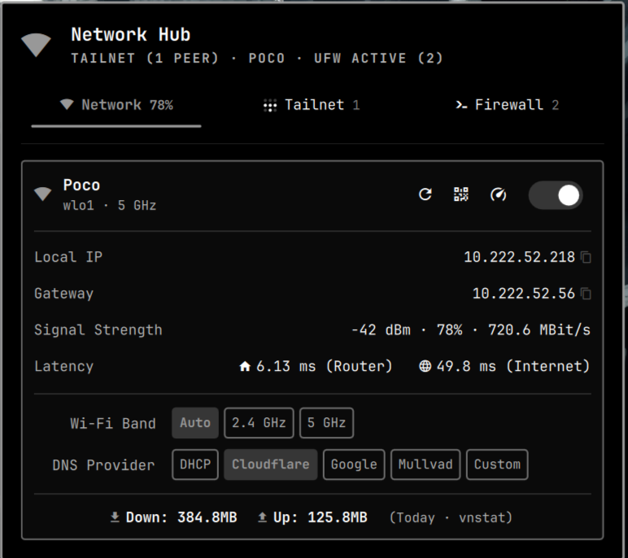
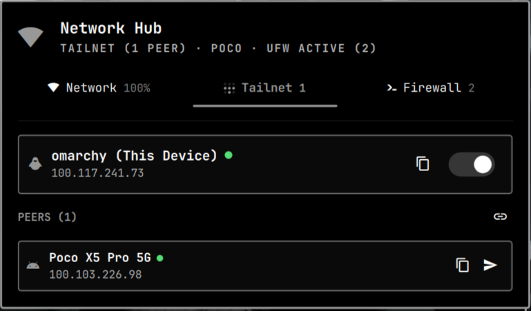
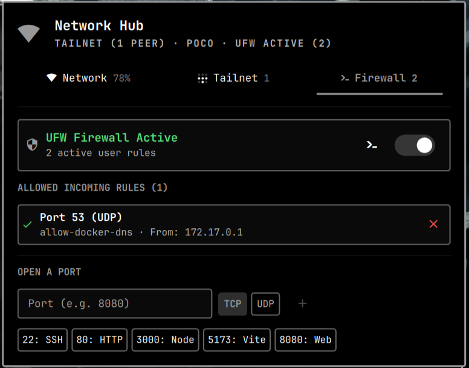

# OmaNetHub — Omarchy Network Hub

Unified Network, Tailscale, and Firewall management plugin for [Omarchy](https://omarchy.org/).

Combines Wi-Fi controls, DNS/band management, signal & latency diagnostics, Tailscale peer browsing with Taildrop file sharing, and UFW firewall management — in a single bar widget.

## Screenshots

| Network | Tailnet | Firewall |
|---|---|---|
|  |  |  |

<details>
<summary>View individual tabs</summary>

### Network Tab


### Tailnet Tab


### Firewall Tab


</details>

## Features

### Network
- Wi-Fi radio toggle, restart, and QR code (via `omarchy.wifiqr`)
- Connected SSID, interface, frequency/band, signal strength, bitrate, and latency (router + internet ping via `omarchy-network-status`)
- Local IP / gateway display with one-click copy to clipboard (`wl-copy`)
- Wi-Fi band steering: Auto / 2.4 GHz / 5 GHz (via `omarchy-network-band`)
- DNS provider presets: DHCP, Cloudflare, Google, Mullvad, Custom (via `omarchy-dns`)
- Daily data usage (Down/Up via `vnstat` or `/proc/net/dev`)
- Speed test summon (via `omarchy.speedtest`)

### Tailnet (Tailscale)
- Status card for this device: hostname, Tailscale IP, OS icon, online indicator, toggle (`tailscale up` / `down`)
- Peer list from `tailscale status --json` with OS icons, IP, DNS name, online state
- Copy actions: IPv4, hostname, or DNS name per peer
- Taildrop file sharing:
  - Per-peer send button (opens file picker if no files pre-selected)
  - Drag & drop files onto the bar icon or anywhere in the panel
  - Auto-send when only one online peer exists, otherwise peer picker
- Admin console shortcut (`https://login.tailscale.com/admin/machines`)

### Firewall (UFW)
- UFW status card: active/inactive, rule count, enable/disable toggle (`sudo ufw enable/disable`)
- Allowed incoming rules list (parsed from `/etc/ufw/user.rules`) with per-rule close action
- Open a port: port number + TCP/UDP chip, with quick presets (22, 80, 3000, 5173, 8080)
- View verbose status in floating terminal (`sudo ufw status verbose`)

### Nautilus Integration
- **Send via Taildrop** context menu for GNOME Files (Nautilus). Right-click any file(s) → Send via Taildrop → choose online peer.
- Auto-installed on panel open via `nautilus-python` extension to `~/.local/share/nautilus-python/extensions/taildrop.py` (requires `nautilus -q` to reload).

## Installation

```bash
omarchy plugin add https://github.com/yashwk/OmaNetHub.git
```

The plugin is installed to `~/.config/omarchy/plugins/yashwanth.link/` as a git checkout.

Then enable and place it:

```bash
omarchy plugin enable yashwanth.link
omarchy bar move yashwanth.link --section right
# or enable via Omarchy menu → Setup → Plugins
```

To update later:

```bash
omarchy plugin update yashwanth.link
# or update all
omarchy plugin update
```

### Manual install

1. Clone to `~/.config/omarchy/plugins/yashwanth.link/`:
   ```bash
   git clone https://github.com/yashwk/OmaNetHub.git ~/.config/omarchy/plugins/yashwanth.link
   ```
2. `omarchy-shell shell rescanPlugins`
3. `omarchy plugin enable yashwanth.link`

## Usage

### Bar icon
The widget shows signal/network state (`󰤨` / `󰤥` / `󰤟` / `󰈀` for wired, `󰤮` when offline) in the bar. Click to open the three-tab panel (Network / Tailnet / Firewall). The tab bar shows badges: signal %, peer count, or UFW rule count.

### Drag & Drop (Taildrop)
- Drag file(s) over the **bar icon** — the panel auto-opens to Tailnet with a drop target.
- Drop files onto a **peer row** inside the panel to send directly to that peer.
- Drop files onto the **panel overlay** — if one online peer, sends immediately; if multiple, pick the target device; choose Cancel to abort.

Behind the scenes, sends use `tailscale file cp` via `bin/taildrop-direct-send` and `bin/taildrop-menu-send` (with `omarchy-file-select` / `omarchy-menu-select` helpers).

### Nautilus
After first open, the extension is copied if changed. Restart Nautilus if the menu does not appear:

```bash
nautilus -q
```

## Requirements

- Omarchy shell (`omarchy-shell` / Quickshell) — `omarchy plugin` and `omarchy-shell shell summon` helpers
- `tailscale` CLI (for Tailnet tab; optional otherwise) — `tailscale status --json`
- `jq` (parsing `tailscale` JSON in `status.sh`)
- `wl-copy` (clipboard copy)
- `nmcli` / NetworkManager (network state, optional helpers: `omarchy-network-status`, `omarchy-network-band`, `omarchy-dns`, `omarchy-wifiqr`, `omarchy.speedtest`)
- `vnstat` (optional, nicer daily usage; falls back to `/proc/net/dev`)
- `ufw` (optional, Firewall tab)
- `xdg-open` (admin console link)
- GNOME Files + `nautilus-python` (optional, for context menu)

All dependencies are soft — tabs degrade gracefully when tools are missing.

## Configuration

No extra config required. The widget persists as `yashwanth.link` in `~/.config/omarchy/shell.json` under `bar.layout.right` once enabled.

To customize position:

```bash
omarchy bar move yashwanth.link --section center
```

## Troubleshooting

- **Validate manifest before publishing:**
  ```bash
  omarchy plugin validate ~/.config/omarchy/plugins/yashwanth.link
  ```
- **Logs:** `journalctl --user -u omarchy-shell` or `omarchy debug`
- **Rescan after editing:**
  ```bash
  omarchy-shell shell rescanPlugins
  # or
  omarchy restart shell
  ```
- **Firewall actions need sudo** — ensure your user can run `sudo ufw ...` (polkit will prompt).

## Development

```bash
git clone https://github.com/yashwk/OmaNetHub.git
cd OmaNetHub
# Edit Panel.qml / Model.js / status.sh / action.sh
omarchy plugin validate .
```

## License

MIT — see [LICENSE](LICENSE) if present.

---

Made for Omarchy. Plugin id: `yashwanth.link` (`~/.config/omarchy/plugins/yashwanth.link/`)
